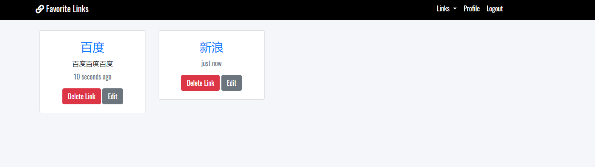

## File Structure
- database, 
- src
- docs 图片
```
    |-- database                          		// 数据库
    |   |-- db.sql                              // 创建数据库的脚本（.sql文件），可以拷贝，然后在navicat中执行，从而创建数据库结构
    |-- docs                                    // readme.md中图片文件
    |-- src                              		// 源码目录
    |   |-- lib
    |   |  |-- auth.js                          // 基于认证判断是否登录，index页面时候，点击Profile的时候判断
    |   |  |-- handlebar.js                     // timego.js，因为启动的时候报错了，因此我在作者基础上做了修改
    |   |  |-- helper.js                        // 基于bcryptjs，密码加密和解密
    |   |  |-- passport.js                      // 基于passport做的登陆认证(Authentication)
	|   |-- public                       		// 项目静态资源目录 css 背景图片等
    |   |-- routes                  			// 路由文件
    |   |-- views             			        // 页面文件
    |   |   | index.hbs                         // 项目入口页面
    |   |-- database.js                         // 数据库连接
    |   |-- index.js                            // npm run dev的时候，启动的文件
    |   |-- key.js                              // 数据库配置文件
```

# 项目说明
1. 项目是基于passport做的登陆认证(Authentication)
2. 数据库查询promise化，可以使用es6 async await语法
```
const { promisify }= require('util');
// Promisify Pool Querys  异步promise化
pool.query = promisify(pool.query);

// 使用
router.get('/', isLoggedIn, async (req, res) => {
    const links = await pool.query('SELECT * FROM links WHERE user_id = ?', [req.user.id]);
    res.render('links/list', { links });
});
```
3. express-mysql-session 将session存储到mysql数据库中

4. 尽可能的注释，视图引擎hbs不用理解 

# 启动服务 localhost:4000
npm run dev

# Notes App with Nodejs and Mysql


